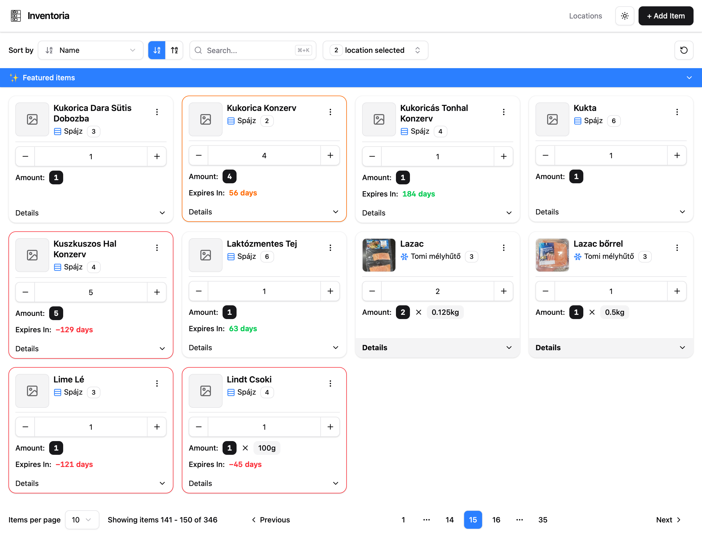
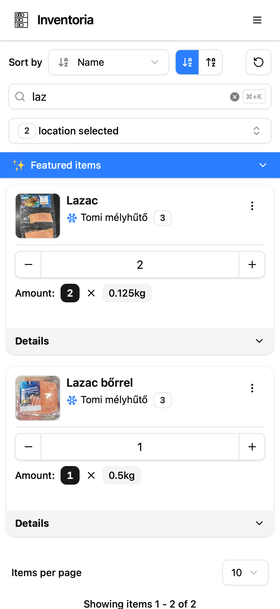

# Inventoria

Ever found a mystery can at the back of your pantry, or a freezer container that might be soup… or might be lasagna?\
I have — and that’s exactly why **Inventoria** exists.

With **Inventoria**, you can:

- Track where your items are stored (pantry, fridge, freezer, etc.)
- See when items will expire
- Add products manually or by scanning a barcode
- Automatically fetch product details from [Open Food Facts](https://world.openfoodfacts.org)

## Screenshots

| Desktop                      | Mobile                     |
| ---------------------------- | -------------------------- |
|  |  |

## Installation

### 1️⃣ Setup

```bash
# Create a folder and enter it
mkdir inventoria && cd inventoria

# Download the production docker-compose file
wget https://raw.githubusercontent.com/szakitom/inventoria/refs/heads/main/docker-compose-prod.yml

# Create an environment file
touch .env
```

### 2️⃣ Configure Environment

Fill in your `.env` file using this template:

```bash
CF_TUNNEL_TOKEN=<token>
RUSTFS_ACCESS_KEY=<username>
RUSTFS_SECRET_KEY=<password>
OFF_USER_AGENT=<app name>/<version> (<url or contact>) # required by Open Food Facts terms
```

### 3️⃣ Run the Application

```bash
docker compose -f docker-compose-prod.yml -p inventoria-prod up -d --pull always
```

### 4️⃣ Access Inventoria

Your app will be available at:
[http://localhost:3000](http://localhost:3000)

> ⚠️ Before using, create at least **one location** in the app.

## TODOs

- [ ] Refresh Open Food Facts data when barcode exists but product data is missing
- [ ] Automated database & S3 backups
- [ ] SSE-based expiring items notifications
- [ ] Automated Docker builds
- [ ] SSR route splitting
- [ ] Redirect to Locations page if no locations exist (fresh install)
- [ ] Real-time updates (WebSocket?)
- [ ] Manage location types (add & edit)
- [ ] Edit shelves without replacement
- [ ] Restrict location editing to empty ones
- [ ] Add error boundary with toast notifications ([react-error-boundary](https://github.com/bvaughn/react-error-boundary))
- [ ] Scheduled S3 cleanup
- [ ] Swagger API documentation
- [ ] Optional text recognition ([react-tesseract](https://github.com/m-maaz-azhar/react-tesseract))
- [ ] Code cleanup

## Development Notes

```bash
mkcert -uninstall
```
